<p align="center">
  
</p>

<p align="center">
  
</p>

<h3 align="center">
  <em>「べ、別にあなたのために作ったわけじゃないんだから！」</em><br/>
  <sub>A tsundere Japanese maid AI that runs entirely on local AI.<br/>Voice chat with your own personal maid who speaks in bilingual JRPG-style dialogue.</sub>
</h3>

<p align="center">
  <a href="#-features"><strong>Features</strong></a> &nbsp;&bull;&nbsp;
  <a href="#-quick-start"><strong>Quick Start</strong></a> &nbsp;&bull;&nbsp;
  <a href="#-architecture"><strong>Architecture</strong></a> &nbsp;&bull;&nbsp;
  <a href="#-documentation"><strong>Docs</strong></a>
</p>

<p align="center">
  
  
  
  
</p>

<p align="center">
  
  
</p>

---

## 🌸 Demo

https://github.com/user-attachments/assets/40af9fdb-bc31-4757-9f24-381a8e207d73

<details>
<summary><strong>View animated terminal demo (SVG)</strong></summary>
<br/>
<p align="center">
  
</p>
</details>

---

## ✨ Features

<table>
<tr>
<td width="50%" valign="top">

### 🗾 Bilingual Dialogue
JRPG-style conversation — Sakura speaks in natural Japanese first, followed by an English translation. Just like a real visual novel.

</td>
<td width="50%" valign="top">

### 🎙️ Voice Chat
Speak naturally using mlx-whisper with silero-vad silence detection. Optimized for Apple Silicon via MPS. Press `SPACE` to talk.

</td>
</tr>
<tr>
<td width="50%" valign="top">

### 🎭 14 Emotion Expressions
Dynamic emotion detection with locally generated anime images (Animagine XL 4.0 via diffusers). Displayed inline in iTerm2.

</td>
<td width="50%" valign="top">

### 🔒 100% Local AI
Runs entirely on your machine with Ollama + dolphin-mistral. No cloud APIs for conversation. Your data stays yours.

</td>
</tr>
<tr>
<td width="50%" valign="top">

### 🧠 Conversation Memory
Persistent memory across sessions with automatic summarization. Sakura remembers your past conversations and references them naturally.

</td>
<td width="50%" valign="top">

### 💢 Tsundere Personality
Sakura is cold at first but gradually warms up. She calls you ご主人様 (Goshujin-sama) and is proud of her maid skills — though she would never admit she cares.

</td>
</tr>
<tr>
<td colspan="2" valign="top">

### 🔓 Uncensored AI
Powered by dolphin-mistral, an unfiltered model with no refusal guardrails — enabling authentic and unrestricted character roleplay.

</td>
</tr>
</table>

> [!NOTE]
> Text-to-speech uses Edge TTS (ja-JP-NanamiNeural voice) which requires an internet connection for audio generation. All AI conversation processing is fully local.

---

## 🚀 Quick Start

### Prerequisites

| Requirement | Details |
|:--|:--|
| **Python** | 3.12+ |
| **Ollama** | [Install Ollama](https://ollama.ai/) and ensure it is running |
| **macOS** | Apple Silicon (M1/M2/M3/M4) for MPS acceleration |
| **iTerm2** | Required for inline emotion image display |
| **Hugging Face Token** | [Get a token](https://huggingface.co/settings/tokens) (for one-time image generation) |
| **ffmpeg** | Required by pydub for bilingual audio concatenation |

### Setup

```bash
git clone https://github.com/FunnyValentine69/maidai-v3.git
cd maidai-v3
pip install -r requirements.txt
ollama pull dolphin-mistral
export HF_API_TOKEN=your_token_here
python -m sakura.setup       # Generate emotion images (one-time)
python -m sakura.animate     # Generate animated character GIF (one-time)
python -m sakura
```

> [!TIP]
> You only need to run `sakura.setup` and `sakura.animate` once. After that, just `python -m sakura` to start chatting.

### Controls

| Input | Action |
|:--|:--|
| Type + `Enter` | Send a text message |
| `SPACE` (first character) | Activate voice input |
| `Ctrl+C` | Exit gracefully (Sakura says goodbye!) |

---

## 🏗️ Architecture

```mermaid
graph TD
    A["🎤 User Input"] -->|Text or Voice| B{"Input Router"}
    B -->|Text| D["Ollama (dolphin-mistral)"]
    B -->|Voice| C["mlx-whisper + silero-vad"]
    C -->|Transcription| D
    D -->|Bilingual Response| E["Emotion Detection"]
    E --> F["Rich Terminal UI"]
    E --> G["Emotion Image Display"]
    F -->|"JP + EN text"| H["Edge TTS (Nanami)"]
    H -->|"JP audio + EN audio"| I["🔊 afplay"]
    G -->|"iTerm2 inline"| J["🖼️ Cached Emotion Image"]

    style A fill:#FF69B4,stroke:#FF1493,color:#fff
    style D fill:#A855F7,stroke:#7C3AED,color:#fff
    style F fill:#FF69B4,stroke:#FF1493,color:#fff
    style H fill:#A855F7,stroke:#7C3AED,color:#fff
```



> [!IMPORTANT]
> Sakura's bilingual output follows a strict format: Japanese text first, a `---` separator, then English translation. The TTS generates both audio tracks in parallel and concatenates them with a 0.5s pause.

---

## 🗂️ Documentation

| Document | Description |
|:--|:--|
| [CLAUDE.md](CLAUDE.md) | Development guidelines and conventions |
| [ARCHITECTURE.md](ARCHITECTURE.md) | Full system architecture and component details |
| [TODO.md](TODO.md) | Project roadmap and task tracking |

---

<details>
<summary><strong>📁 Project Structure</strong></summary>
<br/>

```
maidai-v3/
├── sakura/                   # Main package
│   ├── __init__.py
│   ├── __main__.py           # Entry point
│   ├── core.py               # Main conversation loop
│   ├── ai.py                 # Ollama integration + bilingual parsing
│   ├── speech.py             # Voice input (mlx-whisper + silero-vad)
│   ├── tts.py                # Text-to-speech (Edge TTS + afplay)
│   ├── emotions.py           # Emotion detection + image display
│   ├── memory.py             # Conversation persistence + summarization
│   ├── ui.py                 # Rich terminal UI (JRPG-style panels)
│   ├── config.py             # Configuration constants
│   ├── setup.py              # One-time emotion image generation
│   ├── animate.py            # Animated GIF generation (AnimateDiff)
│   └── nsfw_prompts.example.py  # NSFW prompt template
├── assets/
│   ├── sakura.gif            # Animated blinking character (README display)
│   ├── sakura.png            # Static character art (animation source)
│   ├── sakura-demo.svg       # Animated terminal demo
│   └── cache/                # Cached emotion images (14 emotions)
├── data/
│   └── history/              # Saved conversations + summaries
├── requirements.txt
├── pyproject.toml
└── LICENSE
```

</details>

<details>
<summary><strong>🎭 Emotion System — All 14 Emotions</strong></summary>
<br/>

| Emotion | Trigger Examples |
|:--|:--|
| **Happy** | Good news, successful tasks, praise (she hides it) |
| **Sad** | User leaving, disappointing news |
| **Angry** | User being rude, frustrating situations |
| **Surprised** | Unexpected information, sudden events |
| **Shy** | Compliments, romantic topics |
| **Thinking** | Complex questions, pondering solutions |
| **Excited** | Interesting tasks, topics she secretly enjoys |
| **Tired** | Late night conversations, repetitive questions |
| **Confused** | Unclear requests, contradictions |
| **Neutral** | Default state, routine interactions |
| **Love** | Deep appreciation moments (rare, hard to trigger) |
| **Worried** | User mentions problems, health concerns |
| **Proud** | Completing difficult tasks, showing off skills |
| **Playful** | Teasing the user, witty banter |

Images are generated locally with [Animagine XL 4.0](https://huggingface.co/cagliostrolab/animagine-xl-4.0) during the one-time setup step and cached to `assets/cache/`.

</details>

<details>
<summary><strong>🔧 Troubleshooting</strong></summary>
<br/>

#### Sakura won't speak
- Check that Edge TTS has internet connectivity
- Verify `afplay` is available (macOS built-in)

#### Voice recognition not working
- Ensure microphone permissions are granted in System Settings
- Check that mlx-whisper model downloads successfully on first run
- silero-vad requires internet on the first launch (loaded via torch.hub)

#### Ollama connection failed
- Verify Ollama is running: `ollama list`
- Check `OLLAMA_HOST` environment variable (default: `http://localhost:11434`)

#### Images not displaying
- Emotion images require iTerm2 for inline display
- Run `python -m sakura.setup` if `assets/cache/` is empty
- Ensure `HF_API_TOKEN` is set for the setup script

#### High memory usage during setup
- Image generation with SDXL uses significant VRAM
- The setup script uses MPS (Metal Performance Shaders) on Apple Silicon
- Close other GPU-intensive apps during image generation

</details>

<details>
<summary><strong>⚙️ Environment Variables</strong></summary>
<br/>

| Variable | Default | Description |
|:--|:--|:--|
| `OLLAMA_HOST` | `http://localhost:11434` | Ollama API endpoint |
| `HF_API_TOKEN` | — | Hugging Face token (for image generation setup) |
| `SAKURA_DEBUG` | `false` | Enable debug logging |
| `SAKURA_NSFW` | `false` | Enable NSFW image mode (requires local config) |

</details>

---

## 🙏 Credits

**Created by** [FunnyValentine69](https://github.com/FunnyValentine69)

**Built with:**

| Component | Technology |
|:--|:--|
| Local AI | [Ollama](https://ollama.ai/) + [dolphin-mistral](https://ollama.com/library/dolphin-mistral) |
| Text-to-Speech | [Edge TTS](https://github.com/rany2/edge-tts) (ja-JP-NanamiNeural) |
| Speech Recognition | [mlx-whisper](https://github.com/ml-explore/mlx-examples) (Apple Silicon) |
| Voice Activity Detection | [silero-vad](https://github.com/snakers4/silero-vad) |
| Emotion Images | [Animagine XL 4.0](https://huggingface.co/cagliostrolab/animagine-xl-4.0) via [diffusers](https://github.com/huggingface/diffusers) |
| Character Animation | [AnimateDiff](https://github.com/guoyww/AnimateDiff) + [Counterfeit V3.0](https://huggingface.co/gsdf/Counterfeit-V3.0) |
| Terminal UI | [Rich](https://github.com/Textualize/rich) |

---

## 📄 License

This project is licensed under the MIT License — see the [LICENSE](LICENSE) file for details.

<p align="center">
  
</p>
